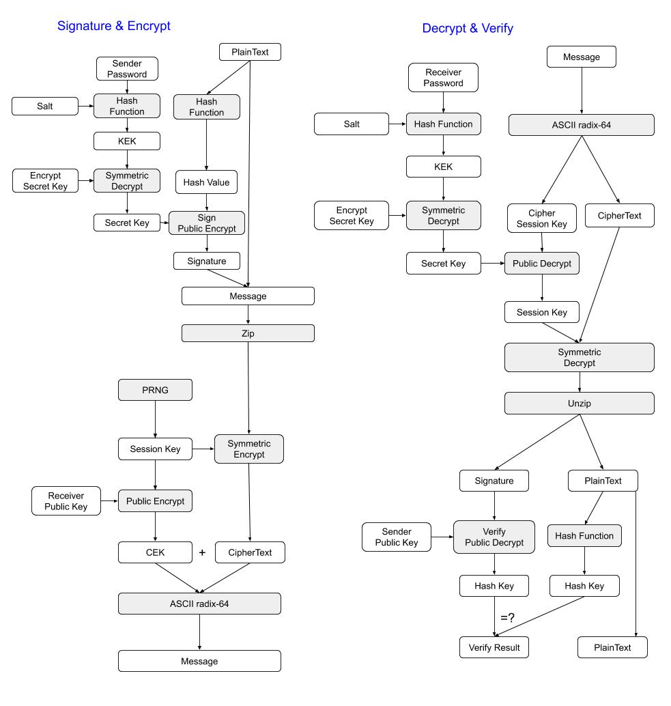

# rcmixed
Mixed cryptosystem. inspired by PGP.

- [x] key store.
- [x] public key cryptography + symmetric cryptography.
- [ ] DH cryptography + symmetric cryptography.
- [ ] feature implement:
  - [ ] RSA + AES-CBC + SHA(2, 3)
  - [ ] DH-RSA + AES-CBC + SHA(2, 3)
  - [ ] x25519(DH + curve25519) + AES-CBC + SHA(2, 3)
- [ ] Failure.
- [ ] Tests.
- [ ] Bench.
- [ ] Doc.

### Singature & Encrypt Function

## License

This project is licensed under either of

 * Apache License, Version 2.0, ([LICENSE-APACHE](LICENSE-APACHE) or
   http://www.apache.org/licenses/LICENSE-2.0)
 * MIT license ([LICENSE-MIT](LICENSE-MIT) or
   http://opensource.org/licenses/MIT)

at your option.

